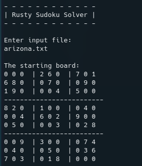

# Rusty Sudoku Solver



## Motivation

Having a decent understanding of backtracking algorithms, I wanted to revisit
this project with the more secure systems language.  
This project allowed me to gain more experience with file I/O, gathering user
input, and handling backtracking algorithms.

## Prerequisites

1. Have GIT version control installed
2. Have Rust installed, can install [here](https://doc.rust-lang.org/book/ch01-01-installation.html)
3. Clone this repo

```bash
git clone https://github.com/OkelleyDevelopment/rusty_sudoku.git
```

## Program Compilation and Execution

1. Inside the project `src/` directory, run the command:

```bash
cargo run
```

2. Input the name of a sudoku board found in `./src/unsolved`
3. If possible to be solved, the user will be prompted for an output file.
   `<your file name here>.txt`. Make sure to include the file extension.

## Known Bugs

At this time, no known bugs are present.

## Future Goals

- Revisit to optimize
- Improved backtracking algorithm
